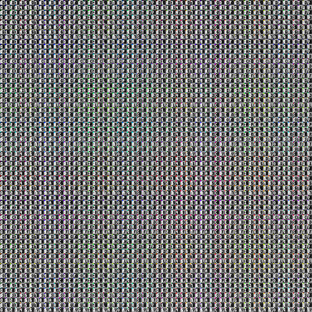
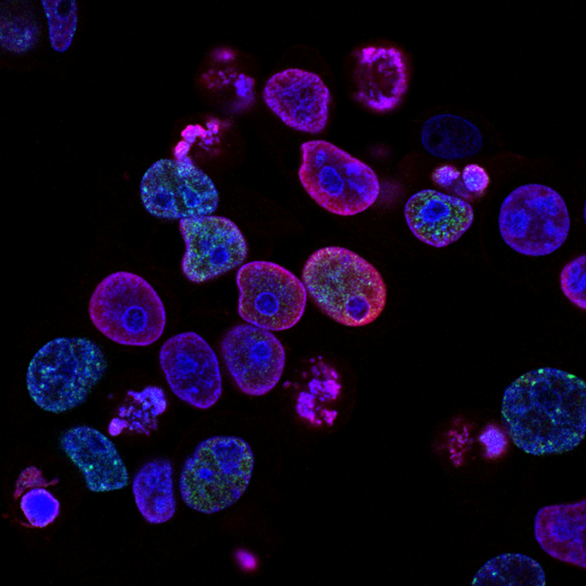

Sample Images
=============

Coordinate Grid
---------------

Synthetic test image generated by John Pocock 2022. CC0 (public domain).
The image is a 512x512 grid of block which are each 8x8 pixels. Each
block contains a unique four pixel signature in the top left, the
coordinate of the block, and a fine pixel-level checkerboard pattern.

**File Name(s):**
`XYC.png`

**Creator(s):**
John Pocock

**Date Created:**
2022-02-22

**Restrictions:**
No known restrictions. The image is CC0 licensed (public domain).

CMU-1 Small Region
------------------

A small region of the CMU-1 test image from OpenSlide.

**File Name(s):**
`CMU-1-Small-Region.svs` (original),
`CMU-1-Small-Region.jpg`

**Creator(s):**
Unknown

**Restrictions:**
No known restrictions. The image is CC0 licensed (public domain).

Purple Cells
------------

Image published by the National Cancer Institute. The image shows human
colorectal cancer cells treated with a topoisomerase inhibitor and an
inhibitor of the protein kinase ATR (ataxia telangiectasia and Rad3
related). Each RGB channel represents a different stain. The red channel
shows DNA damage (gamma-H2AX) the blue channel shows the cell nuclei,
and the green channel shows foci of DNA replication.

**File Name(s):**
`atr-induced_damage.jpg`

**Creator(s):**
Yves Pommier and Rozenn Josse

**Date Created:**
2014-12

**Restrictions:**
No known restrictions. The image is in the public domain.

**Source:**
https://visualsonline.cancer.gov/details.cfm?imageid=9888

Licenses
========

CC0
---

Creetive Commons Zero (CC0) is a public domain license. It waives all
copyright to the extent that is possible under the law.

For more information, see
https://creativecommons.org/publicdomain/zero/1.0/. 